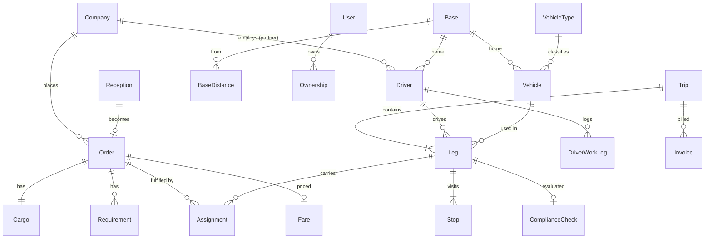

# ロジポケ配車Agent ― 理想のデータ構造設計

> 物流配車管理 + AI電話受付サービスを、プロトタイプ（静的HTML/in-memory/localStorage）から
> 本番運用に耐えるデータモデルへ引き上げるための設計ドキュメント。
>
> 現状の `index.html` / `ai-phone-reception.html` に存在する実データ構造を分析し、
> 正規化・単一情報源（Single Source of Truth）・拡張性を満たす理想形を定義する。

---

## 1. 目的とスコープ

| 項目 | 内容 |
| --- | --- |
| 対象ドメイン | 物流配車（受注 → 配車計画 → 運行 → 完了 → 請求）+ AI電話受付 |
| 解決したい課題 | ID不統一・名前ベース参照・多重複製・状態文字列の散在・運行レイヤーの三重管理 |
| 想定永続化 | RDB（PostgreSQL想定）。フロントは正規化キャッシュ + localStorage はUI状態とオフライン下書きのみ |
| 記法 | TypeScript interface（精度重視・言語非依存）。`?` は任意、`// 旧:` は現状コードとの対応 |

### 関連ドキュメント / 成果物

| ファイル | 内容 |
| --- | --- |
| [`docs/operation-layer-deep-dive.md`](./operation-layer-deep-dive.md) | 運行層 Trip/Leg/Stop/Assignment の深掘り設計（不変条件・運行パターン別の表現・派生ビュー） |
| [`db/schema.sql`](../db/schema.sql) | 実際のDDL（PostgreSQL 16）。型・制約・索引・派生ビュー。**適用検証済み** |
| [`migration/transform_prototype.mjs`](../migration/transform_prototype.mjs) | 現行プロトタイプJSデータ → 新スキーマ への移行(ETL)スクリプト |
| [`db/seed_from_prototype.sql`](../db/seed_from_prototype.sql) | 上記が生成する投入SQL（中継案件 `20240524104` 等を含む） |
| [`db/README.md`](../db/README.md) | 適用手順・検証済みの性質 |

> 上記DDL・移行は PostgreSQL 16 で実際に適用し、EXCLUDE制約による重複配車の拒否、
> 派生ビューによる旧3画面の復元まで動作確認済み。

---

## 2. 現状データ構造の課題（分析結果）

実コードから抽出した、本番化を阻む7つの構造的課題。

| # | 課題 | 現状の例（ファイル内） | 影響 |
| --- | --- | --- | --- |
| C1 | **ID形式の不統一** | 案件: `'20240524001'`（数値文字列）, AI受付: `'AI20260529...'`, トースト: `'C-2821'`, 中継: `'-L1'` サフィックス | 名寄せ・突合が不能。重複検知が脆い |
| C2 | **新旧ID系統の二重化** | ドライバー `'D001'`（新）と `'V1382'`（旧=車両番号）を `_legacyDriverIdToNew()` で橋渡し | 変換コードが恒久的に必要、バグ温床 |
| C3 | **名前ベースの参照** | `assignment.client='株式会社○○商事'`, `case.driver='山田 一郎'`, `case.vehicle='車両1245'` | 改名で参照断絶、JOIN不能、表記ゆれ |
| C4 | **複合値の文字列埋め込み** | `goods:'パレット / 800kg / 常温'` を正規表現 `/([\d,]+)\s*kg/` で抽出 | 積載量チェックが文字列パース依存で不安定 |
| C5 | **時刻・期限の自由文字列** | `deadline:'05/25 AM指定'` / `'本日中'` / `'05/19 13:00 集荷指定'` が混在 | ソート・期限超過判定・タイムゾーン管理が不能 |
| C6 | **運行レイヤーの三重管理** | `scheduleData`（ガント）/ `assignments`（レイヤー2）/ `dndDrivers`（DnD盤）が別配列で相互変換 | 同期ズレ、どれが真かが不明 |
| C7 | **案件の状態複製と多テーブル分割** | `allCasesMasterData` / `unprocessedCases` / `processingCases` / `processedCases` に同一案件が重複し、`status` 文字列も `未処理/未解析/要確認/処理中/完了/過去` と非一貫 | 一覧の不整合、状態遷移が追えない |

> 一方で、現状コードには**良い設計の萌芽**も多くある。これらは理想形に引き継ぐ:
> - `bases` + `_baseDistanceMap`（拠点・拠点間距離マスタ）
> - `drivers` / `vehicles` の分離（ドライバーは車両を持たない・車両は複数拠点 `baseIds[]`）
> - `Assignment` レイヤー（`effectiveBaseId` / `ownerId` / `relatedReturnId` / `crossBase`）
> - 多段運行の `role`/`handoffType`（`preload`/`transport`/`delivery`/`relay_leg`, `overnight_park`/`driver_swap`/`depot_transfer`/`parallel`）
> - 担当・ロック・チーム（`driverOwners` / `driverLocks` / `TEAM_MEMBERS`）

---

## 3. 設計原則

1. **単一情報源（SSoT）** ― 運行の真実は `Trip`/`Leg`/`Stop` の1系統のみ。ガント・DnD盤・案件タイムラインはすべてこの派生ビュー。（→C6）
2. **代理キー + 参照はIDのみ** ― 全エンティティは安定したプレフィックス付きIDを持ち、相互参照は必ずID。表示名は参照先から解決。（→C2,C3）
3. **複合値の構造化** ― 荷・住所・時間枠・運賃は値オブジェクトとして分解。文字列パースを撲滅。（→C4,C5）
4. **状態は列挙 + 状態機械** ― `status` は enum。遷移は定義された状態機械に従い、履歴を `*_events` に残す。（→C7）
5. **マスタ／受付／案件／運行／請求の層分離** ― ライフサイクルと更新頻度の異なるデータを混ぜない。
6. **時刻はISO 8601 + IANA TZ** ― 保存は `Asia/Tokyo` 明示のISO文字列。「AM/本日中」等は別途 `TimeWindow` で表現。（→C5）
7. **追記型の監査** ― 変更は `audit_log` に追記。配車は複数人協調のため誰がいつ何を変えたかを保持。
8. **派生値はキャッシュと割切る** ― 距離・運賃・法令適合は計算結果のスナップショットを持ちつつ、入力が変われば再計算可能に。
9. **協力会社は一級市民** ― 自社/協力会社をParty/Resourceで統一的に扱い、`isPartner` フラグと所属で区別。
10. **段階移行可能** ― 現行プロトタイプのIDをエイリアスとして保持し、無停止で移行できる形にする（§9）。

---

## 4. 全体アーキテクチャ

```
┌─────────────────────────────────────────────────────────────────┐
│ ① マスタ層 (Master)                                               │
│   Company(Client/Partner) │ Base │ BaseDistance │ Driver │ Vehicle │
│   VehicleType │ User │ RecurringRoute │ BillingFormat              │
└─────────────────────────────────────────────────────────────────┘
            │ 参照
┌───────────▼─────────────┐     ┌──────────────────────────────────┐
│ ② 受付層 (Reception)     │ ──▶ │ ③ 案件層 (Order)                  │
│   Reception(AI/電話/メール) │     │   Order │ Cargo │ Location │      │
│   AiExtraction           │     │   TimeWindow │ Requirement       │
└─────────────────────────┘     └──────────────┬───────────────────┘
                                                │ 1案件 → N運行 (relay/相積み/戻り)
                                 ┌──────────────▼───────────────────┐
                                 │ ④ 運行層 (Operation) ★SSoT        │
                                 │   Trip ─< Leg ─< Stop             │
                                 │   Assignment(Order↔Leg)           │
                                 └───┬───────────────┬──────────────┘
                                     │               │
                       ┌─────────────▼──┐   ┌────────▼─────────────┐
                       │ ⑤ 法令層        │   │ ⑥ 運賃・請求層        │
                       │ ComplianceCheck │   │ Fare │ Invoice       │
                       │ DriverWorkLog   │   └──────────────────────┘
                       └─────────────────┘
┌─────────────────────────────────────────────────────────────────┐
│ ⑦ 協調・監査層 (横断): Ownership │ Lock/Presence │ AuditLog │ Notification │
└─────────────────────────────────────────────────────────────────┘
```

### 4.1 主要エンティティ関係（ER）



> **要点**: 案件(`Order`)と運行(`Trip`)は **多対多**（`Assignment` が中間）。
> これにより「1案件を中継で2台」「1台で複数案件を相積み」「戻り回送」を統一的に表現できる（現状の `vehicleMode: single/relay/multi` と `legs[]` を正規化）。

---

## 5. エンティティ定義

### 共通型

```typescript
// ISO 8601 文字列（例: "2026-05-29T13:00:00+09:00"）。保存は常にTZ付き。
type IsoDateTime = string;
type IsoDate     = string; // "2026-05-29"

// プレフィックス付き代理キー。例: "ord_01HZ...", "trip_01HZ..."（ULID推奨）
type Id<T extends string> = `${T}_${string}`;

// 監査用の共通フィールド（全永続エンティティに付与）
interface Auditable {
  createdAt: IsoDateTime;
  createdBy: Id<'usr'>;
  updatedAt: IsoDateTime;
  updatedBy: Id<'usr'>;
  version:   number;        // 楽観ロック用
}

// 旧プロトタイプIDの保持（移行用・§9）
interface LegacyRef {
  legacyIds?: string[];     // 例: ["20240524001", "C-2821"]
}
```

### 値オブジェクト

```typescript
// 地点（C3/C5解決: 住所文字列ではなく構造化 + 拠点解決済み）
interface Location {
  raw:        string;          // 入力された生住所「神奈川県横浜市（横浜港）」
  prefecture: string;          // 神奈川県
  city:       string;          // 横浜市
  detail?:    string;          // 横浜港・バース番号など
  postalCode?: string;
  geo?:       { lat: number; lng: number };
  baseId?:    Id<'base'>;      // 解決された自社拠点（旧 resolveBaseIdByAlias 相当）
}

// 荷（C4解決: "パレット / 800kg / 常温" を分解）
interface Cargo {
  description: string;         // 表示用「建材」
  packaging:   'pallet' | 'case' | 'bulk' | 'roll' | 'container' | 'other';
  packageCount?: number;       // パレット枚数など
  weightKg:    number;         // 数値で保持（積載量チェックが安定）
  volumeM3?:   number;
  tempZone:    'ambient' | 'chilled' | 'frozen';  // 常温/冷蔵/冷凍
  hazardous?:  boolean;
  notes?:      string;
}

// 時間枠（C5解決: "05/25 AM指定" / "本日中" を構造化）
interface TimeWindow {
  earliest?: IsoDateTime;      // この時刻以降
  latest?:   IsoDateTime;      // この時刻まで（締切）
  label?:    string;           // 表示用ヒント「AM指定」「集荷指定」
  strict:    boolean;          // 時間厳守か（旧 conditions:'時間厳守'）
}

// 金額（最小単位=円, 整数）
interface Money { amount: number; currency: 'JPY'; }
```

---

### ① マスタ層

```typescript
// 会社（荷主・協力会社を統一。旧 clientMasterData + partnerMasterData）
interface Company extends Auditable, LegacyRef {
  id:        Id<'co'>;                 // 旧 "CL-001" / "PT-001"
  kind:      'client' | 'partner';     // 荷主 / 協力会社
  name:      string;
  location:  Location;                 // 旧 area
  contact:   { name: string; tel: string; email: string };
  // 荷主のみ
  clientType?: 'regular' | 'spot' | 'charter' | 'special' | 'chilled'; // 旧 定期/スポット/...
  billingFormatId?: Id<'fmt'>;         // 旧 defaultFormatId
  // 協力会社のみ
  serviceableVehicleTypeIds?: Id<'vtype'>[]; // 旧 vehicleTypes[]
  // 旧 cases:[] は逆参照（Order.clientId）で解決 → 非正規化を排除
}

// 拠点（旧 bases。良い設計なので踏襲）
interface Base extends Auditable {
  id:      Id<'base'>;        // 旧 "B001"
  name:    string;            // 川口拠点
  region:  string;            // 関東
  location: Location;
  aliases: string[];          // ["川口市","川口","埼玉県川口市"] 住所解決用
}

// 拠点間距離（旧 _baseDistanceMap。対称・km）
interface BaseDistance {
  fromBaseId: Id<'base'>;
  toBaseId:   Id<'base'>;
  distanceKm: number;
  estDriveMin?: number;       // 標準所要時間（あれば）
}

// 車格マスタ（旧 allVehicleTypes / TYPES を実体化）
interface VehicleType extends Auditable {
  id:        Id<'vtype'>;
  name:      string;          // "4tウィング"
  bodyType:  'flatbed' | 'wing' | 'box' | 'reefer' | 'freezer'; // 平/ウィング/箱/冷蔵/冷凍
  tonClass:  number;          // 4
  maxLoadKg: number;          // 4000
  tempZones: Cargo['tempZone'][]; // 対応温度帯
}

// 車両（旧 vehicles。ドライバーは持たない＝良い設計を踏襲）
interface Vehicle extends Auditable, LegacyRef {
  id:          Id<'veh'>;     // 旧 "V1382"（plate "車両1382" は表示専用に降格）
  plateLabel:  string;        // 表示名 "車両1382"
  vehicleTypeId: Id<'vtype'>; // type/ton/maxLoad は VehicleType から解決（C3）
  homeBaseId:  Id<'base'>;    // 戻り先
  baseIds:     Id<'base'>[];  // 所属拠点（長距離車は複数）
  status:      'active' | 'maintenance' | 'retired';
}

// ドライバー（旧 drivers。車両を持たない＝良い設計を踏襲）
interface Driver extends Auditable, LegacyRef {
  id:          Id<'drv'>;     // 旧 "D001"（"V1382" 互換は legacyIds で保持→C2解消）
  name:        string;
  licenses:    ('medium' | 'large' | 'trailer')[]; // 中型/大型/けん引
  isPartner:   boolean;
  partnerCompanyId?: Id<'co'>;   // 協力会社所属なら（旧 partnerName を正規化）
  homeBaseId?: Id<'base'>;       // 協力会社は null 可
  defaultOwnerId?: Id<'usr'>;    // 既定の配車担当
  employment:  'active' | 'leave' | 'retired';
}

// 社内ユーザー / 配車担当（旧 TEAM_MEMBERS）
interface User extends Auditable {
  id:      Id<'usr'>;         // 旧 "me","u2"...
  name:    string;
  role:    'dispatcher' | 'manager' | 'admin' | 'viewer';
  color:   string;            // UI表示色
  active:  boolean;
}

// 定期便マスタ（旧 TEIKI_SAMPLES。Order 自動生成のテンプレート）
interface RecurringRoute extends Auditable {
  id:        Id<'route'>;
  name:      string;                       // "東京〜大阪 定期便"
  pattern:   'trunk' | 'store' | 'milkrun';// 幹線/店舗配送/巡回
  clientId:  Id<'co'>;                     // 旧 client(名前) → ID参照
  origin:    Location;
  destination: Location;
  frequency: { type: 'weekly' | 'monthly' | 'daily'; daysOfWeek?: number[] };
  activeFrom: IsoDate;
  activeTo?:  IsoDate;
  standardFare: Money;                     // 旧 fare:'85000'(文字列) → 構造化
  preferredVehicleTypeId: Id<'vtype'>;
  autoCreateOrder: boolean;                // 旧 autoReflect
  details:   Record<string, string>;       // 旧 detail{}（任意属性）
  notes?:    string;
}
```

---

### ② 受付層（AI電話受付 → 案件化）

```typescript
// 受付（旧 ai-phone-reception.html の intake。localStorage キュー INTAKE_QUEUE_KEY を正規化）
interface Reception extends Auditable, LegacyRef {
  id:        Id<'rcpt'>;                 // 旧 "AI20260529134501"
  channel:   'ai_phone' | 'phone' | 'mail' | 'web' | 'manual'; // 旧 ch + source
  receivedAt: IsoDateTime;               // 旧 receivedAt
  status:    'pending' | 'reviewing' | 'confirmed' | 'rejected' | 'duplicated';
  // AI抽出結果（人手確認前の生データ）
  extraction: AiExtraction;
  transcript?: string;                   // 通話文字起こし全文
  audioUrl?:  string;
  // 案件化された場合のリンク（受付→案件は 1:0..1）
  orderId?:  Id<'ord'>;
  reviewedBy?: Id<'usr'>;
}

// AI抽出（旧 intake の各フィールド + 信頼度。確定情報ではなく「候補」）
interface AiExtraction {
  confidence: 'high' | 'medium' | 'low';  // 旧 aiResult.confidence
  clientName?: string;                     // 名寄せ前の生テキスト
  matchedClientId?: Id<'co'>;              // 名寄せできた場合
  origin?:    Partial<Location>;
  destination?: Partial<Location>;
  cargo?:     Partial<Cargo>;
  timeWindow?: Partial<TimeWindow>;
  conditions?: string[];                   // 旧 conditions（"バース予約済み"等）
  suggestedVehicleTypeId?: Id<'vtype'>;    // 旧 aiResult.vehicle
  suggestedCount?: number;                 // 旧 aiResult.count
}
```

> **連携の理想形（旧 localStorage 片方向キューの置換）**:
> AI受付は `Reception`(status=`pending`) を作成 → 配車側の「未処理」キューに即時反映（WebSocket/SSE）。
> 配車担当が内容確認し `confirmed` にすると `Order` が生成される。
> ID は受付時にサーバ発番で一意（旧 `'AI'+日時` の衝突リスクと重複チェックを排除→C1）。

---

### ③ 案件層（Order）

```typescript
// 案件（旧 allCasesMasterData / unprocessedCases / processingCases / processedCases を1テーブルに統合）
interface Order extends Auditable, LegacyRef {
  id:          Id<'ord'>;        // サーバ発番で統一（C1）
  orderNo:     string;           // 人が読む受注番号（表示用・採番ルール固定）
  clientId:    Id<'co'>;         // 旧 client(名前) → ID参照（C3）
  receptionId?: Id<'rcpt'>;      // 受付起点なら
  recurringRouteId?: Id<'route'>;// 定期便起点なら

  origin:      Location;
  destination: Location;
  cargo:       Cargo;            // 旧 goods 文字列 → 構造化（C4）
  pickupWindow:   TimeWindow;    // 旧 deadline 文字列 → 構造化（C5）
  deliveryWindow: TimeWindow;

  pattern:     'regular' | 'spot' | 'charter' | 'special' | 'multidrop'; // 旧 casePattern
  priority:    'normal' | 'urgent';        // 旧 priority 緊急/通常
  requirements: Requirement[];             // 特殊条件を構造化

  status:      OrderStatus;                // enum + 状態機械（C7）
  channel:     Reception['channel'];

  // 派生・サマリ（運行確定後に充填。真実は Assignment/Leg 側）
  primaryAssignmentId?: Id<'asgn'>;
  fareId?:     Id<'fare'>;
}

// 状態機械（旧 未処理/未解析/要確認/処理中/完了/過去 を整理）
type OrderStatus =
  | 'draft'        // 受付確認前の下書き
  | 'unassigned'   // 未割当（旧 未処理/未割当）
  | 'assigning'    // 配車中（旧 処理中）
  | 'assigned'     // 配車確定
  | 'in_transit'   // 運行中
  | 'completed'    // 完了（旧 完了）
  | 'invoiced'     // 請求済み
  | 'cancelled';
// 「過去」は status ではなく期間フィルタ（completedAt < N日前）で表現

// 状態遷移は追記イベントで記録（誰がいつ何を）
interface OrderEvent {
  id: Id<'oev'>;
  orderId: Id<'ord'>;
  from: OrderStatus; to: OrderStatus;
  at: IsoDateTime; by: Id<'usr'>;
  reason?: string;
}

// 特殊条件（旧 conditions 自由文字列 → タイプ化で検索/マッチング可能に）
interface Requirement {
  type: 'tail_lift' | 'forklift' | 'temp_control' | 'time_strict'
      | 'berth_reserved' | 'attendant' | 'multi_drop' | 'other';
  value?: string;       // 補足（温度帯・バース番号など）
}
```

---

### ④ 運行層（Trip / Leg / Stop / Assignment）★単一情報源

> 現状の `scheduleData`（ガント行+blocks）/ `assignments`（レイヤー2）/ `dndDrivers`（DnD盤）/
> `legs[]`（中継）/ ジョブ generator の `sequenceNo/role/handoff` を、**この4エンティティに統合**する。
> ガント・DnD盤・案件タイムラインはすべてこの派生ビュー（C6解消）。

```typescript
// 運行（1台のドライバー×車両が担う、1つ以上の区間からなる仕事のまとまり）
interface Trip extends Auditable, LegacyRef {
  id:        Id<'trip'>;       // 旧 jobId "J-...-RELAY"
  tab:       'planning' | 'confirmed';   // 旧 scheduleData の planning/confirmed
  serviceDate: IsoDate;        // 基準日（複数日運行は Leg 側で表現）
  status:    TripStatus;
  // 多段運行の意味づけ（旧 vehicleMode / multiReasons）
  shape:     'single' | 'relay' | 'co_load' | 'multiday' | 'return'; // 単一/中継/相積み/日跨ぎ/戻り回送
  multiReasons?: string[];     // 旧 multiReasons（"改善基準対策"等）
  ownerId:   Id<'usr'>;        // 担当（旧 driverOwners → Trip単位に正規化）
  mainOwnerId: Id<'usr'>;      // 主担当（旧 mainOwnerId）
  relatedReturnTripId?: Id<'trip'>;  // 戻り回送の相方（旧 relatedReturnId）
}

type TripStatus = 'planned' | 'confirmed' | 'in_progress' | 'completed' | 'cancelled';

// 区間（1ドライバー×1車両が連続して動く単位。中継=Legが複数で別ドライバー）
interface Leg extends Auditable {
  id:          Id<'leg'>;      // 旧 legId "relay-104-1"
  tripId:      Id<'trip'>;
  sequenceNo:  number;         // 旧 legNo / sequenceNo（1始まり）
  driverId:    Id<'drv'>;      // ID参照（旧 driverName 文字列→C3）。ドライバーは車両と独立に選択
  vehicleId?:  Id<'veh'>;      // ID参照（旧 "車両2580"→C3）。傭車(isHired)時は未設定＝自社マスタ外
  // 傭車（協力会社車両）。プロト leg.partnerVehicle。vehicleId は持たず協力会社・傭車運賃・POを伴う
  isHired?:    boolean;
  hiredCompanyId?: Id<'co'>;   // 傭車先（kind='partner'）
  hiredCharge?: Money;         // 傭車運賃（協力会社 partnerRates: base + perKm×距離）
  purchaseOrderNo?: string;    // 傭車の発注書番号（PO）
  effectiveBaseId: Id<'base'>; // 当日の実働拠点（旧 effectiveBaseId。既定＝車両拠点）
  crossBase:   boolean;        // クロス配車か（ドライバー拠点≠実働拠点。旧 isCrossBaseAssignment）
  // 便ごとの積載按分は Assignment.loadedWeightKg（Order×Leg）で表現（プロト leg.loadKg）。
  // 相積みは複数 Assignment の loadedWeightKg 合算 ≦ 車両最大積載。温度帯は VehicleType.tempZones と照合。

  role:        LegRole;        // 旧 role
  startDateTime: IsoDateTime;  // 旧 startTime/startDateTime（日付込みで日跨ぎ対応→C5）
  endDateTime:   IsoDateTime;

  // 引き継ぎ（中継・前日積込の接続。旧 handoffType/handoffLocation/nextJobId）
  handoff?: {
    type: 'overnight_park' | 'driver_swap' | 'depot_transfer' | 'parallel';
    location?: string;         // "中継ターミナル"
    nextLegId?: Id<'leg'>;
  };
  // 作業内訳（分）。旧 loadMin/driveMin/unloadMin
  workMinutes: { load: number; drive: number; unload: number; rest?: number };
}

// 区間の役割（旧 role の enum 化）
type LegRole = 'pickup_delivery' | 'preload' | 'transport' | 'delivery' | 'relay';

// 立寄地（区間内の発着・経由。旧 from/to を地点列に正規化、多地点配送に対応）
interface Stop {
  id:        Id<'stop'>;
  legId:     Id<'leg'>;
  sequenceNo: number;
  kind:      'pickup' | 'dropoff' | 'relay_handoff' | 'depot' | 'rest';
  location:  Location;         // 旧 relayFrom/relayTo/from/to
  plannedArrival?: IsoDateTime;
  plannedDeparture?: IsoDateTime;
  orderId?:  Id<'ord'>;        // この立寄が紐づく案件
}

// 割当（案件 ↔ 区間 の多対多中間。"どの荷をどの区間で運ぶか"）
interface Assignment extends Auditable, LegacyRef {
  id:        Id<'asgn'>;       // 旧 "A00001"（_newAssignmentId 踏襲可）
  orderId:   Id<'ord'>;
  legId:     Id<'leg'>;
  loadedWeightKg?: number;     // 相積み時の按分
  note?:     string;
}
```

> **これで表現できる運行パターン**:
> - 通常便: `Trip(single)` → `Leg`×1 → `Stop`(pickup/dropoff)、`Assignment`×1
> - 中継便（旧 relay）: `Trip(relay)` → `Leg`×2（ドライバー違い）、`handoff.type='driver_swap'`、`Assignment` は同一 Order を両 Leg に
> - 相積み: `Leg`×1 に `Assignment`×N（複数 Order）
> - 前日積込/長距離3日便: `Leg` を日付跨ぎで複数、`handoff.type='overnight_park'`
> - 戻り回送: `Trip.relatedReturnTripId` でペア

---

### ⑤ 法令層（改善基準告示チェック）

```typescript
// 法令チェック結果（旧 vehicles[].law を区間/ドライバー単位のスナップショットに）
interface ComplianceCheck extends Auditable {
  id:        Id<'comp'>;
  legId:     Id<'leg'>;
  driverId:  Id<'drv'>;
  evaluatedAt: IsoDateTime;
  overall:   'ok' | 'warn' | 'violation';   // 旧 status ok/warn(+ng)
  items:     ComplianceItem[];
}

// 改善基準告示の各項目（旧 law.items の6項目を enum 化）
interface ComplianceItem {
  rule: 'daily_drive'      // 日間運転時間（9h）
      | 'duty_hours'       // 拘束時間（13h）
      | 'weekly_cap'       // 週間上限（65h）
      | 'interval_rest'    // 勤務間休息（インターバル）
      | 'continuous_drive' // 連続運転制限
      | 'break_rule';      // 休憩確保（30分ルール）
  ok:      boolean;
  actual:  number;         // 実績値（数値で保持）
  limit:   number;         // 上限値
  unit:    'hour' | 'minute';
  message: string;         // 旧 val "連続運転3.6h — あと0.4hで上限"
}

// ドライバー稼働実績（compliance の計算ソース）
interface DriverWorkLog {
  id:        Id<'wlog'>;
  driverId:  Id<'drv'>;
  date:      IsoDate;
  driveMinutes: number;
  dutyMinutes:  number;
  restMinutes:  number;
  weeklyDriveMinutes: number;  // 週累計
  legIds:    Id<'leg'>[];      // 由来区間
}
```

---

### ⑥ 運賃・請求層

```typescript
// 運賃（旧 fareResult / fare 文字列 → 内訳構造化）
interface Fare extends Auditable {
  id:        Id<'fare'>;
  orderId:   Id<'ord'>;
  base:      Money;            // 基本運賃
  distanceKm: number;
  surcharges: { kind: 'fuel' | 'toll' | 'waiting' | 'highway' | 'special'; amount: Money; note?: string }[];
  total:     Money;
  source:    'manual' | 'recurring_route' | 'ai_suggested';
}

// 請求（旧 CSV_COLUMNS / processedCases.sales を実体化。完了運行から生成）
interface Invoice extends Auditable, LegacyRef {
  id:          Id<'inv'>;
  invoiceNo:   string;         // 旧 invoiceNo
  clientId:    Id<'co'>;
  tripIds:     Id<'trip'>[];   // 対象運行
  orderIds:    Id<'ord'>[];
  issueDate:   IsoDate;        // 旧 invoiceDate
  dueDate:     IsoDate;        // 旧 due
  lines:       { orderId: Id<'ord'>; sales: Money; fuel?: Money; other?: Money }[];
  total:       Money;          // 旧 sales 合計
  status:      'draft' | 'issued' | 'paid' | 'overdue';
}
```

---

### ⑦ 協調・監査層（横断）

```typescript
// 担当割当（旧 driverOwners。Driver/Trip に対する責任者）
interface Ownership {
  subjectType: 'driver' | 'trip';
  subjectId:   string;
  ownerId:     Id<'usr'>;      // 旧 値（'me','u2'...）
  isPrimary:   boolean;        // 旧 mainOwnerId 相当
}

// 編集ロック / プレゼンス（旧 driverLocks。実運用は WebSocket 同期）
interface EditLock {
  subjectType: 'trip' | 'leg' | 'order';
  subjectId:   string;
  userId:      Id<'usr'>;
  acquiredAt:  IsoDateTime;    // 旧 startedAt
  expiresAt:   IsoDateTime;    // 自動失効
}

// 監査ログ（追記専用。配車は多人数協調のため必須）
interface AuditLog {
  id:        Id<'audit'>;
  at:        IsoDateTime;
  actorId:   Id<'usr'>;
  entity:    string;           // "Trip" / "Order" ...
  entityId:  string;
  action:    'create' | 'update' | 'delete' | 'status_change' | 'reassign';
  diff:      Record<string, { before: unknown; after: unknown }>;
}

// 通知（AI受付着信・法令違反・期限超過など）
interface Notification {
  id:        Id<'ntf'>;
  toUserId:  Id<'usr'>;
  kind:      'new_reception' | 'compliance_warn' | 'deadline_risk' | 'reassigned';
  refType:   string; refId: string;
  message:   string;
  readAt?:   IsoDateTime;
  createdAt: IsoDateTime;
}
```

---

## 6. 識別子（ID）設計

| 種別 | プレフィックス | 例 | 旧形式 |
| --- | --- | --- | --- |
| 会社 | `co_` | `co_01HZ...` | `CL-001` / `PT-001` |
| 拠点 | `base_` | `base_01HZ...` | `B001` |
| 車格 | `vtype_` | `vtype_...` | （文字列のみ） |
| 車両 | `veh_` | `veh_...` | `V1382` |
| ドライバー | `drv_` | `drv_...` | `D001` / `V1382`(旧) |
| ユーザー | `usr_` | `usr_...` | `me`/`u2` |
| 受付 | `rcpt_` | `rcpt_...` | `AI20260529...` |
| 案件 | `ord_` | `ord_...` | `20240524001` |
| 運行 | `trip_` | `trip_...` | `J-...-RELAY` |
| 区間 | `leg_` | `leg_...` | `relay-104-1` |
| 割当 | `asgn_` | `asgn_...` | `A00001` |

- 内部IDは **ULID**（時系列ソート可・分散発番可）を推奨。表示用には別途人間可読な採番（`orderNo`, `invoiceNo`）を持つ（C1解消）。
- 旧IDは各エンティティの `legacyIds[]` に保持し、移行期間の突合・URL互換を担保（C2解消・§9）。

---

## 7. 主要な状態機械

### Order
```
draft → unassigned → assigning → assigned → in_transit → completed → invoiced
   └────────────────────────────── cancelled ──────────────────────┘
```

### Trip
```
planned → confirmed → in_progress → completed
   └──────────── cancelled ───────────┘
```
- `Order.status` は配下 `Trip`/`Leg` の状態から自動昇格（例: 全 Leg が `completed` → Order `completed`）。
- 「過去案件」は状態ではなく `completedAt` の期間フィルタで表現（C7）。

---

## 8. 永続化とフロントの責務分担

| 層 | 保存先 | 理由 |
| --- | --- | --- |
| マスタ/受付/案件/運行/請求 | RDB（PostgreSQL） | 整合性・JOIN・トランザクション |
| リアルタイム同期 | WebSocket / SSE | 受付着信・編集ロック・他者の配車変更 |
| フロント状態キャッシュ | 正規化ストア（Redux/Zustand等） | ID参照を解決して描画。ガント/DnDは派生セレクタ |
| `localStorage` | **UI設定 + オフライン下書きのみ** | 旧 `kpiDockCollapsed`/`dndLeftWidth` は残す。`INTAKE_QUEUE_KEY` のような業務データ連携はやめ、サーバ経由に |

---

## 9. 現状プロトタイプからの移行方針

段階移行で無停止を狙う（設計原則10）。

1. **Phase 0 ― IDの実体化**: `client`/`driver`/`vehicle` の名前参照を、対応するマスタIDへ置換するマッパを用意（旧名→ID辞書）。`legacyIds[]` に旧値を退避。（C2,C3）
2. **Phase 1 ― 値の構造化**: `goods` → `Cargo`、`deadline` → `TimeWindow`、`fare:'85000'` → `Money` へパース変換するマイグレーションを実行。（C4,C5）
3. **Phase 2 ― 運行の一本化**: `scheduleData`/`dndDrivers`/`assignments`/`legs[]` を `Trip`/`Leg`/`Stop`/`Assignment` に集約。現行の派生関数（`_scheduleRowToAssignments` 等）を「SSoT→ビュー」方向に反転。（C6）
4. **Phase 3 ― 案件テーブル統合**: 4分割テーブルを単一 `Order` + `status` enum + `OrderEvent` に統合し、一覧は status/期間フィルタで再現。（C7）
5. **Phase 4 ― 受付のサーバ化**: `localStorage` キューを `Reception` API + リアルタイム通知へ置換。ID衝突・重複検知をサーバ責務に。（C1）

> 既存コードの良い抽象（`bases`/距離マスタ、driver↔vehicle分離、Assignmentの拠点・担当・クロス配車概念、handoff/role）は本設計にそのまま昇格させており、移行は「追加」中心で破壊的変更を最小化できる。

---

## 付録: 現状 → 理想 対応早見表

| 現状（コード） | 理想エンティティ |
| --- | --- |
| `clientMasterData` / `partnerMasterData` | `Company`（`kind` で区別） |
| `bases` / `_baseDistanceMap` | `Base` / `BaseDistance` |
| `drivers` / `vehicles` | `Driver` / `Vehicle` + `VehicleType` |
| `TEAM_MEMBERS` / `driverOwners` / `driverLocks` | `User` / `Ownership` / `EditLock` |
| `TEIKI_SAMPLES` | `RecurringRoute` |
| `intake`(localStorage) / `aiResult` | `Reception` / `AiExtraction` |
| `allCasesMasterData`/`unprocessed`/`processing`/`processedCases` | `Order` + `OrderStatus` + `OrderEvent` |
| `goods` 文字列 / `deadline` 文字列 | `Cargo` / `TimeWindow` |
| `scheduleData` + `dndDrivers` + `assignments` + `legs[]` | `Trip` / `Leg` / `Stop` / `Assignment`（SSoT） |
| `vehicles[].law` | `ComplianceCheck` / `ComplianceItem` / `DriverWorkLog` |
| `fareResult` / `CSV_COLUMNS`(請求) / `sales` | `Fare` / `Invoice` |
